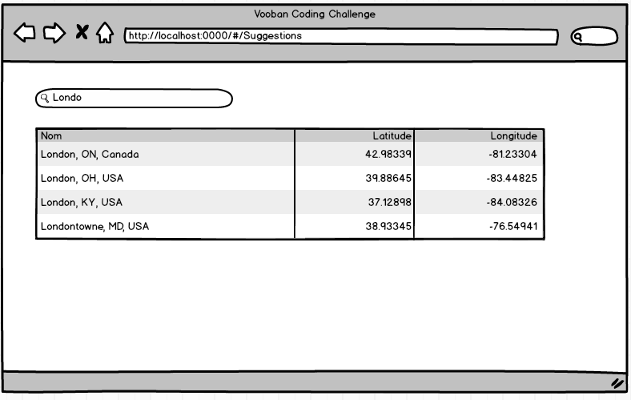

#Introduction
Bienvenue au Coding-Challenge de Vooban.

Cet exercice est fortement inspiré de [https://github.com/busbud/coding-challenge-backend-c].

##Étape 1 - Backend
Coder un API servant à supporter une fonctionnalité de recherche sur des noms de ville.

####Particularités
- L'url de la ressource devrait être `/suggestions`
- La recherche est passée en querystring dans le paramètre `q`.  Ce paramètre est obligatoire.
- On peut ajouter la latitude et la longitude dans les paramètres `lat` et `long` respectivement.  Ces paramètres sont optionnels.
- La source de données est une base de données SQLServer qui se crée automatiquement avec des données via FluentMigrator.  Voir script `.\startup.ps1`
- La réponse de l'API devrait être un JSON contenant un array de suggestions
- Chaque suggestion doit contenir les informations suivantes:
    1) Nom de la ville, son pays et la province ou l'état (Ex: "Montréal, QC, Canada")
    2) Latitude
    3) Longitude
    4) Un score de 0 à 1 indiquant la confiance de la suggestion
- L'algorithme pour déterminer le score est laissé à votre discrétion
- Les suggestions sont retournées en ordre décroissant de score
- Si aucune ville n'est trouvée, retourner une erreur HTTP 404

####Exemple de réponse
```
GET /suggestions?q=Amos&lat=48.13247&long=-77.21413
```

```
{
  "suggestions": [
    {
      "name": "Amos, QC, Canada",
      "latitude": "48.56688",
      "longitude": "-78.11624",
      "score": 1
    }
  ]
}
```

####Technologies à utiliser
- Nhibernate pour l'accès aux données
- ASP.Net Web API pour l'API
- Tout autre choix est laissé à votre discrétion

##Étape 2 - Frontend
Application AngularJS (1.4.*) utilisant l'API développé à l'étape 1 pour suggérer des noms de ville.

####Maquette


####Particularités
- La recherche se déclenche automatiquement lorsqu'il y a 3 caractères ou plus inscrits dans la boite de recherche
- Les résultats sont affichés dans la grille en ordre décroissant de score
- Effacer le contenu de la boite de recherche vide aussi la grille des résultats
- La maquette n'est là qu'à titre indicatif
- Une base d'application est fournie dans la solution de départ mais il n'est pas nécessaire de s'y tenir

##Étape 3 - Tests Specflow
Implémenter les scénarios Specflow du fichier SuggestionsDeVille.feature
